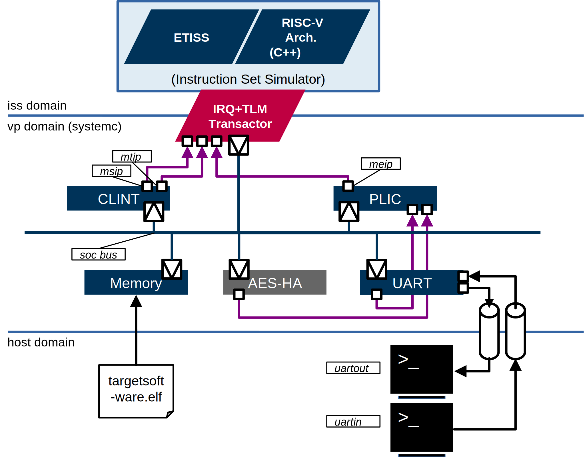

# VP: EDAduino Virtual Prototype



## Build

0. Source the environment

```
    source ../environment.sh
```

1.  Generate (G-)Makefiles with CMake (>v3.15.0):

```
    cmake -S ${VP_DIR} -B build [-DAESVRTL_PREFIX=${AESVRTL_DIR} -D AES_TYPE={basic, dma}]
```

2.  Build:

```
    cmake --build build [--parallel $(nproc)]
```

## Usage
The VP is configured by various 'ini'-files.

### Run in terminal:

```
    <build-dir>/edaduino --etiss ini/etiss.ini --vp ini/vp.ini --elfs <path/to/elf/files> [--tgdb <port>]
```

### Run in terminal with target GDB:

```
    <build-dir>/edaduino --etiss ini/etiss.ini --vp ini/vp.ini --elfs <path/to/elf/files> --tgdb <port>
```    

The ETISS GDB core will halt the target software on main entry. `--tgdb` sets the TCP port value, e.g. 2222. A remote GDB debugger can then connect to local TCP port 2222. Launch a target GDB session and connect to ETISS GDB server with:

```
    <path/to/riscv-toolchain/bin/*gdb` -ex "tar rem :2222" <path/to/elf/files>
```

### Read out UART port:

If stdin/stdout is used in target software, i.e.
`printf()` the VP routes these messages to the virtual UART port. VP's UART opens a POSIX FIFO (named process pipeline) that can be read out from terminal or by other applications that support standard file read/write. To test the UART you can simply use `cat`:

```
    cat uartout
```

### Write to UART port:

either use `cat` to open pipeline as pseudo terminal:

```
    cat > uartin
```

or `echo` to write direct messages:

```
    echo "<message-string" > uartin
```
